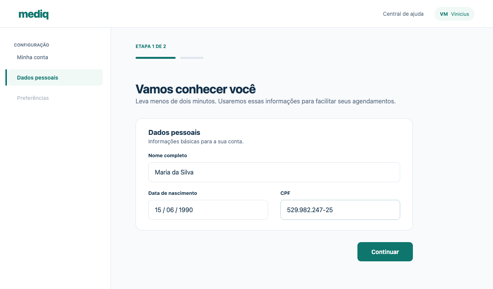
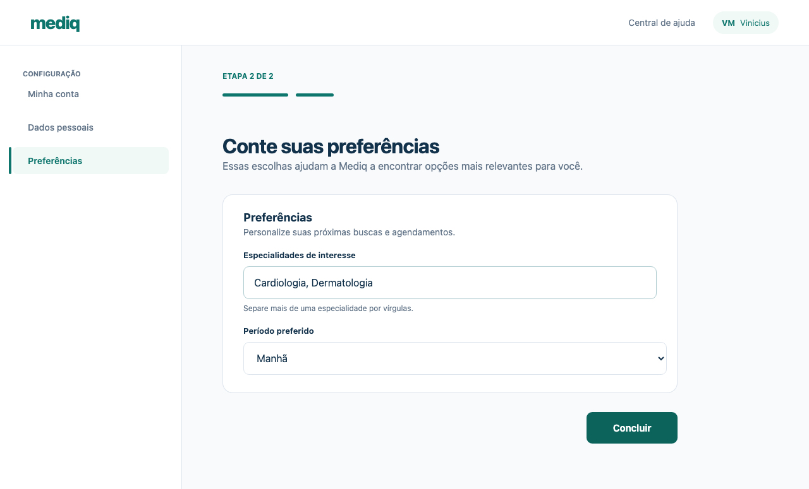
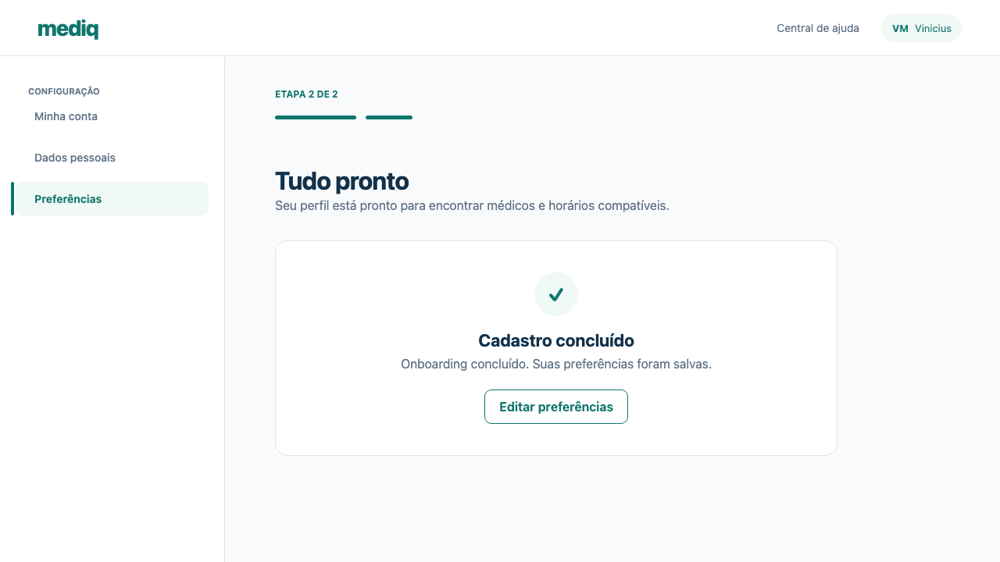

## Evidência de teste — onboarding web

**Resultado:** ✅ fluxo concluído com sucesso

**Comando:** `pnpm evidence:web pr-test-evidence`

### Cenário validado

1. Preenchimento dos dados pessoais.
2. Definição das preferências de atendimento.
3. Confirmação da conclusão do cadastro.

### Capturas

### Artefatos

- [Vídeo completo do fluxo](patient-onboarding-paciente-conclui-o-onboarding-chromium/video.webm)
